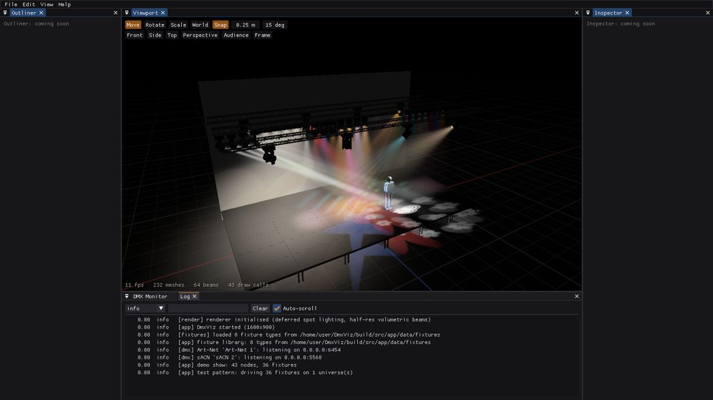

# DmxViz

A real-time 3D visualizer for DMX512 stage lighting. Build a stage, hang
fixtures, point your lighting console at it over Art-Net, sACN or a USB DMX
interface, and see volumetric beams, gobos and colour in haze.

> **Status:** Milestones 0–2 complete; Milestone 3 (hardening) in progress. See [docs/ROADMAP.md](docs/ROADMAP.md).



## Features

* **DMX in and out**: Art-Net, sACN (E1.31), Enttec DMX USB Pro and compatibles,
  Enttec Open DMX; multi-source merging; live DMX monitor.
* **Fixtures**: modern moving lights and LED fixtures (RGB/RGBA, CMY, colour/gobo/animation
  wheels, prisms, zoom/focus/iris/frost, framing shutters, pixel cells), an
  in-app fixture editor, and import from **Open Fixture Library** and **GDTF**.
* **Stage builder**: primitives, truss (box/triangle/ladder profiles), decks, risers, steps,
  imported glTF/OBJ/3DS models, gizmos with snapping, arrays, align/distribute/mirror,
  hang-on-truss, undo/redo, grouping.
* **Rendering**: volumetric haze beams with gobo and prism break-up, projected gobos on
  surfaces, lens glow, HDR bloom and ACES tonemapping; built for 1000+ beams at 60 fps.
* **Test console**: control fixtures by attribute (intensity, colour, position, beam) or raw DMX channels;
  merge with or override incoming DMX.
* **Multi-platform**: Windows and Linux; OpenGL 4.3 GPU required.

Runs on **Windows** and **Linux**. Written in C++20 with sokol, Dear ImGui and
other small open-source libraries (see [ADR 0001](docs/adr/0001-tech-stack.md)).

## Building

Requirements: CMake 3.24+, a C++20 compiler (MSVC 2022, GCC 13+, Clang 16+), git.
On Linux also: `sudo apt install libgl-dev libx11-dev libxi-dev libxcursor-dev`.

```bash
cmake -S . -B build -DCMAKE_BUILD_TYPE=Release
cmake --build build --config Release
./build/src/app/dmxviz          # Windows: build\src\app\Release\dmxviz.exe
```

Dependencies are fetched automatically at configure time.

## Documentation

* **[User Guide](docs/USER_GUIDE.md)** — start here to learn the app
* [Requirements](docs/REQUIREMENTS.md)
* [Architecture](docs/ARCHITECTURE.md)
* [Fixture Format](docs/FIXTURE_FORMAT.md)
* [Roadmap](docs/ROADMAP.md)
* [Architecture decision records](docs/adr/)

## License

MIT, see [LICENSE](LICENSE). Third-party libraries keep their own licenses.
